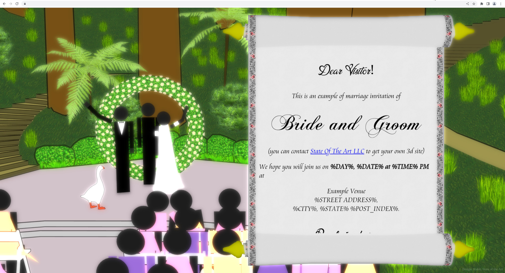
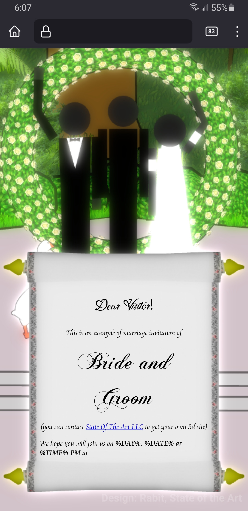

# Visit3D - 3D Site Engine

Visit3D is aimed to prepare a relatively simple starting point / example of creating 3d site.

* [Site page about it](https://www.state-of-the-art.io/projects/visit3d/)



## Features

* Uses only opensource tooling
* Supports Win/Lin/Mac + IOS/Android with Firefox/Chromium/Safari browsers (except for IE or Edge)
* Supports JWE/JWT invite links for personalized messages through templating
* Includes golang-based webserver for easy deployment
* Relatively easily customizable

## Build & Run

1. Open Blender export 2 scenes using GLTFv2 exporter and place them to `static` directory:
   ```
   * Include: Visible Objects, Current Scene, Custom Properties, Cameras, Punctual Lights
   * Transform: +Y Up
   * Geometry: Compression: Level 6, Quantization: 20, Normal: 10, TexCoord: 12, Color: 10, Generic: 12
   * Animation: Animation, Shape Keys, Skinning
   ```
   * `Main` -> main.glb
   * `UI_modern` -> ui.glb.
2. Build visit3d server executable:
   ```
   $ go build ./...
   ```
3. Run visit3d server:
   ```
   ./visit3d localhost:8888 http://localhost:8888/
   ```
4. Go to http://localhost:8888/ and see the site

## Sending invites

You probably want to personalize the messages and do not allow the folks without the invite to
access the page (optional), so it's a good idea to use some sort of token which will contain data.

The project uses JWT encrypted (JWE) tokens which could store and encrypt data. So on server side
it could be decrypted (and if failed decryption deny access) and data could be used to alter the
document using templates.

* Go to `generate_token` directory:
   ```
   $ cd generate_token
   ```
* Create venv:
   ```
   $ python3 -m venv .venv
   ```
* Install dependencies:
   ```
   $ pip install -r requirements.txt
   ```
* Generate your EC private/public key:
   ```
   $ openssl 
   ```
* Generate token:
   ```
   $ ./generate_token.py id=1 'username=Anna and Ivan'
   ```
* Open the altered main URL `http://localhost:8888/?t=<token>` and see the changes in browser
   * Token triggers visit3d server to use `templates/document.html`, so prepare it by using golang
     [html/template](https://pkg.go.dev/html/template) definitions like `{{ .UserName | html }}`.

## License

Repository and it's content is covered by `Apache v2.0` - so anyone can use it without any concerns.

If you will have some time - it will be great to see your changes merged to the original repository -
but it's your choise, no pressure.

## Privacy policy

It's very important to save user private data and you can be sure: we working on security
of our applications and improving it every day. No data could be sent somewhere without
user notification and his direct approve. This application will work standalone without
any internet connection and will not collect any user personal data anyway.
